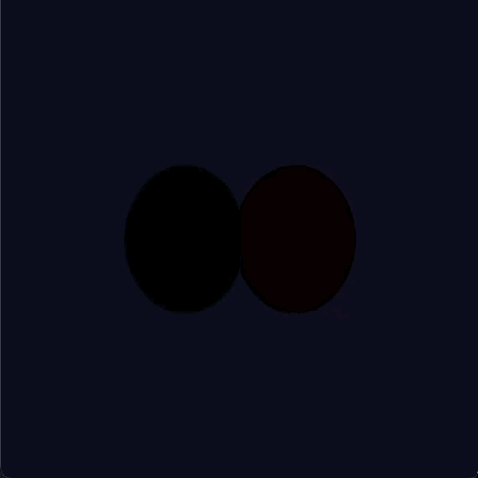

# Rasterizer

A software rasterizer built from scratch in C++ using SDL3 for window and input management.

The goal of this project is to implement the full graphics pipeline manually — without OpenGL, Vulkan, or any rendering API. Every stage from 3D vertex to screen pixel is written by hand.



## What is a rasterizer?

A rasterizer is the process that takes a 3D object defined by vertices and converts it into the pixels you see on screen. This is exactly what OpenGL does under the hood. In this project, that entire pipeline is implemented in software:

```
3D Vertex → World Space → Camera Space → Clip Space → Screen Space → Pixel
```

## What is Phong shading?

Phong shading, unlike flat shading, allows for a smoother shading on objects. A flat shading lights a cubes' face entirely the same shade. On a sphere, the faces have a smoother transition, here is where phong shading shines best (pun intended). Since here the shade is calculated per pixel we can say phong is a superior technique. Here, each pixels normal is taken into account in relation to the light source.

```
    Point3D normal = normalize({
        interpolate(nxL, nxR, j, left, right),
        interpolate(nyL, nyR, j, left, right),
        interpolate(nzL, nzR, j, left, right)
    });

    float dot = dotProduct(normal, light);
    putPixel(surface, j, y, addBrightness(surface, color.r, color.g, color.b, std::max(0.05f, dot)));
```

## Pipeline stages (work in progress)

- [x] Window creation with SDL3
- [x] Triangle drawing (Bresenham line algorithm)
- [x] Scanline rasterization (filled triangles)
- [x] Perspective projection (x/z, y/z with scale + screen centering)
- [x] 3D vertex transformation (rotate X, Y, Z)
- [x] Backface culling (face normal z-component check)
- [x] Depth buffer (z-buffer)
- [x] Mesh definition (vertices + edges + faces)
- [x] Sphere generation (parametric, latitude/longitude)
- [x] Phong shading (per-pixel normal interpolation)
- [x] Vertex normals
- [x] Delta time / FPS counter
- [ ] Camera / view matrix
- [ ] Projection matrix (proper FOV, near/far planes)
- [ ] Texture mapping
- [ ] Multiple light sources
- [ ] OBJ file loading

## Built with

- **C++17**
- **SDL3** — window creation and input handling
- **clang++** — compiler
- **Make** — build system

## Project structure

```
Rasterizer/
├── src/
│   └── main.cpp
├── include/
├── libs/
├── dependencies/
│   └── SDL3.xcframework/
└── Makefile
```

## Getting started

### Requirements

- macOS (Apple Silicon or Intel)
- SDL3 framework
- clang++ (included with Xcode Command Line Tools)

### Build and run

```bash
# Remove quarantine from SDL3 (first time only)
xattr -cr ./dependencies/SDL3.xcframework

# Build
make

# Run
./Rasterizer
```

### Clean build

```bash
make clean
```

## Platform

Developed on macOS with Apple Silicon (M4). SDL3 xcframework includes both arm64 and x86_64 slices.
